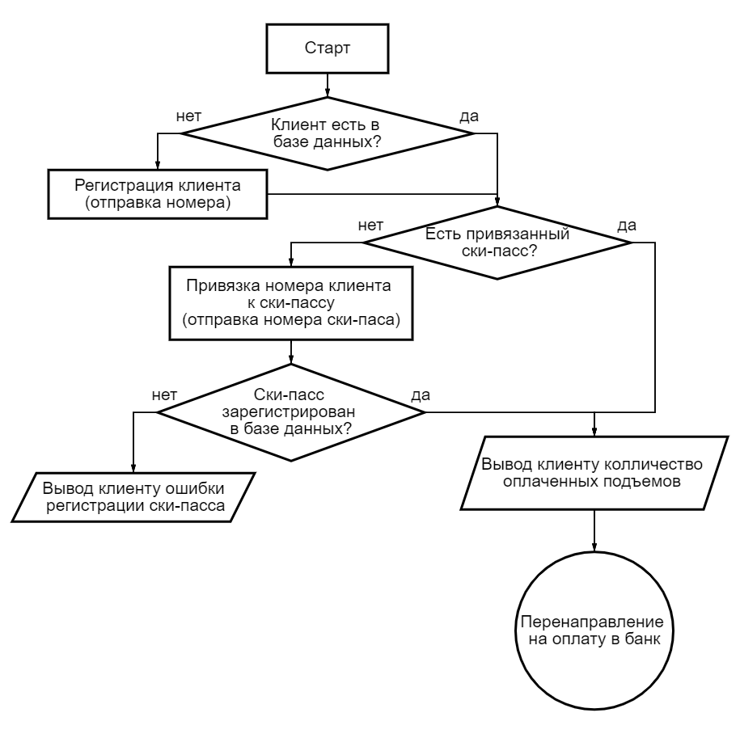

# Телеграм бот для горнолыжных курортов

## Описание идеи проекта:

Телеграм бот для горнолыжных курортов предоставляет возможность:

- Клиентам:
    - Получать сведения о количестве доступных подъемах по данному ски-пассу;
    - Оплачивать подъемы через прямую ссылку, которую генерирует бот, не отрываясь от катания;
    - Получать важную информацию о работе/скидках/новостях горнолыжного курорта.

- Администрации горнолыжного курорта:
    - Пополнять базу данных клиентов (номер телефона, имя, которое указано в телеграм);
    - Уменьшить нагрузку на кассу;
    - Автоматизировать процесс оплаты подъемов;
    - Проводить рекламные/новостные рассылки, а также оповещать клиентов о непредвиденных ситуациях.

## Описание взаимодействия с ботом:

### Скриншоты взаимодействия с ботом смотри ["Скриншоты работы бота"](SCREENSHOTBOT.md)

Основной алгоритм взаимодействия с ботом:



Все взаимодействие с ботом осуществляется через команды меню и кнопки:
- /start - запуск бота;
- /help - вывод информационного сообщения по работе ботом;
- /deletemydata - удаление данных пользователя из базы данных;
- /sendforallclients <ТЕКСТ> - позволяет сделать массовую рассылку для всех зарегистрированных пользователей
  (команда является скрытой, доступная только администраторам горнолыжного курорта);

- Динамические кнопки - это кнопки, которые выводятся во внутренней области чата и привязываются к конкретному
  сообщению.
  Основное общение клиента и бота происходит через динамические кнопки, которые позволяют делать запрос на отправку
  номера, перенаправление клиента на оплату в банковскую систему.

## Запуск приложения

Для запуска установите имя и токен в файле [application.properties](https://github.com/AlexanderTimin96/SkiPass_telegramBot/blob/225739f6d6cdbd901a11428e41a4d655263c065c/src/main/resources/application.properties):

````
bot.name=<ИМЯ БОТА>
bot.token=<ТОКЕН БОТА>
````

Введите в терминале:

```
./mvnw clean package
docker build -t app .
docker-compose up -d
```

## Технологии использующиеся в проекте:

- Spring Boot 3.1.2;
- MAVEN;
- Lombok;
- Spring Data JPA;
- PostgreSQL;
- docker, docker-compose.

## Тестирование приложения

Unit-тестирование в данном проекте не предусматривается.

Телеграм бот протестирован ручным методом.
