# Скриншоты работы с ботом

Стартовое меню бота:

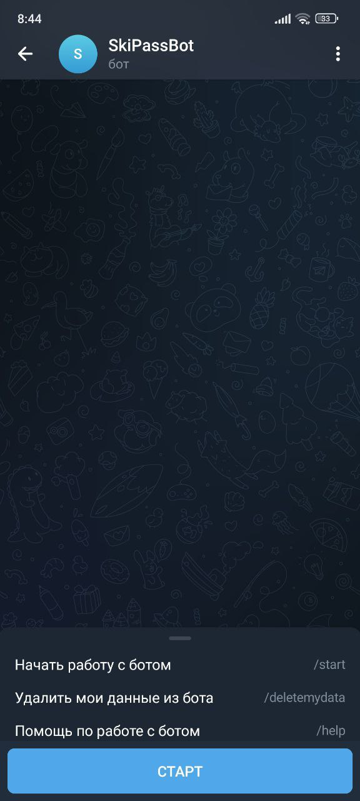

После ввода/выбора команды /start (пользователь не зарегистрирован): 

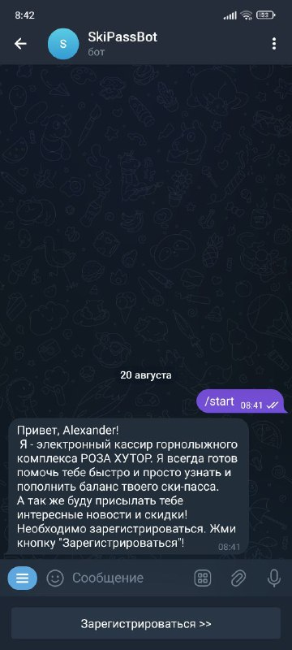

Кнопка "зарегистрироваться" приведет к отправке номера:

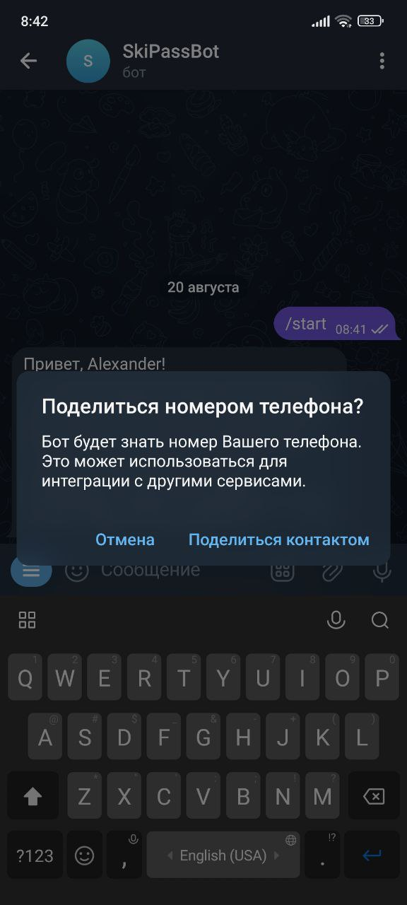

После отправки номера, произойдет регистрация:

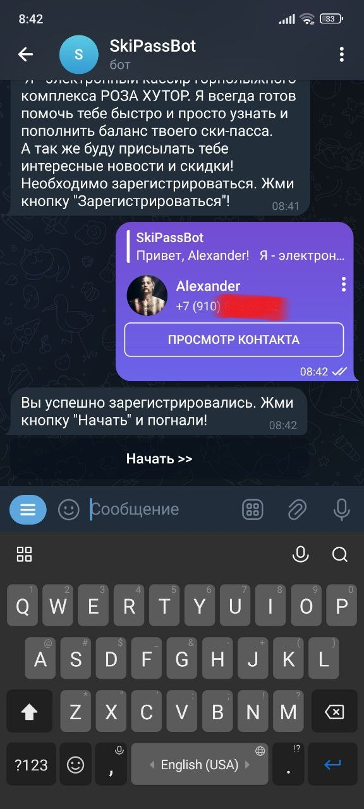

После ввода/выбора команды /start (пользователь зарегистрирован):

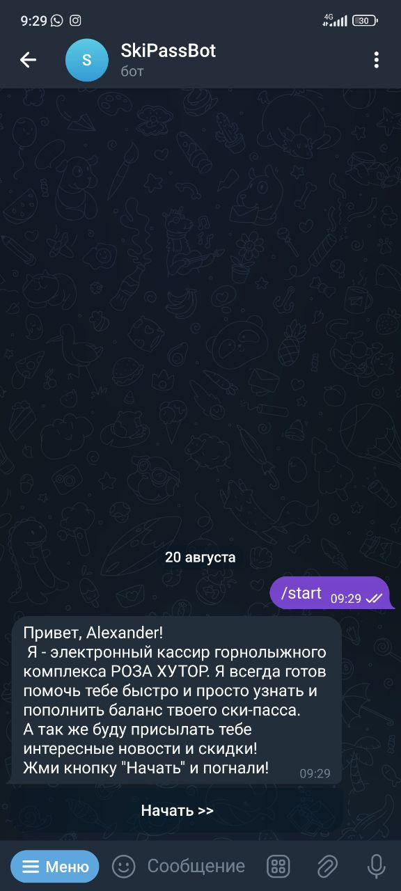

Кнопка "Начать" приведет к проверке есть ли зарегистрированный ски-пасс на номер телефона клиента.
Зарегистрированные ски-пассы не привязаны к данному номеру телефона:

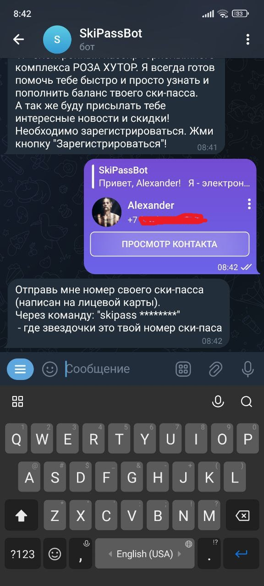

Отправлен не корректный номер ски-пасса:

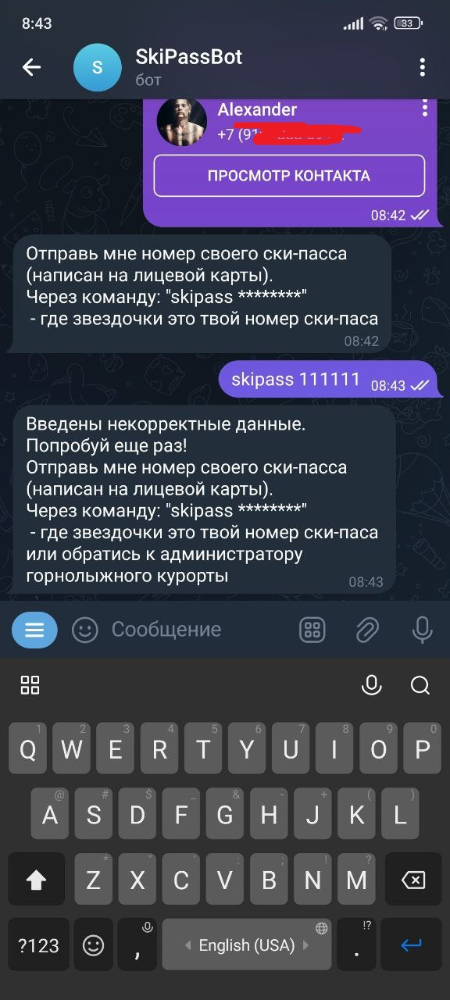

Отправлен корректный номер ски-пасса, либо ски-пасс был привязан ранее:

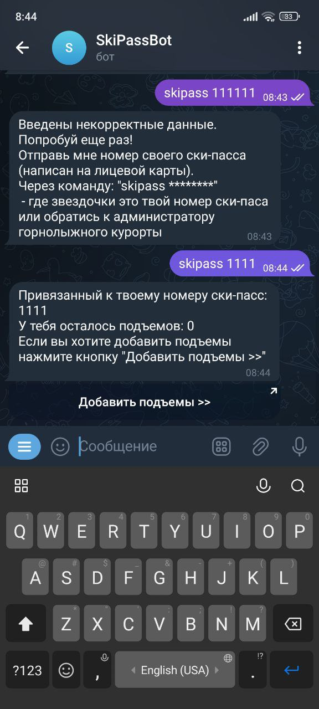

Кнопка "Добавить подъемы" приведет к перенаправлению на оплату в банк:

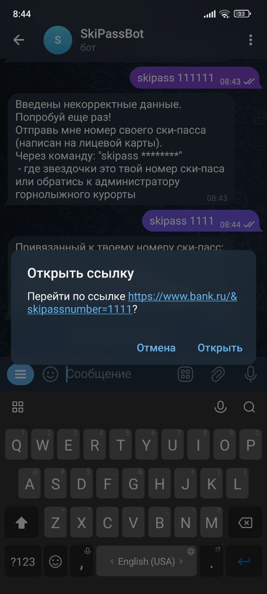

Ввод/выбор команды /help:

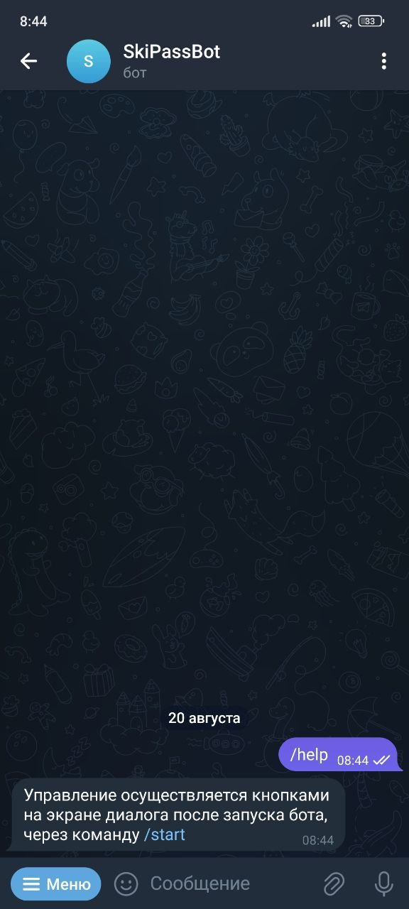

Ввод/выбор команды /deletemydata приведет к удалению данных:

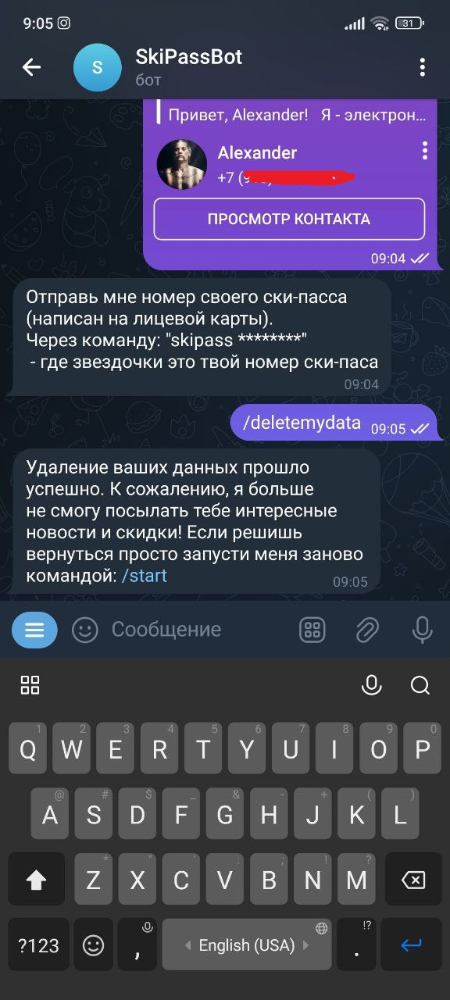

При отправке сообщения пользователем которое не является командой боты:

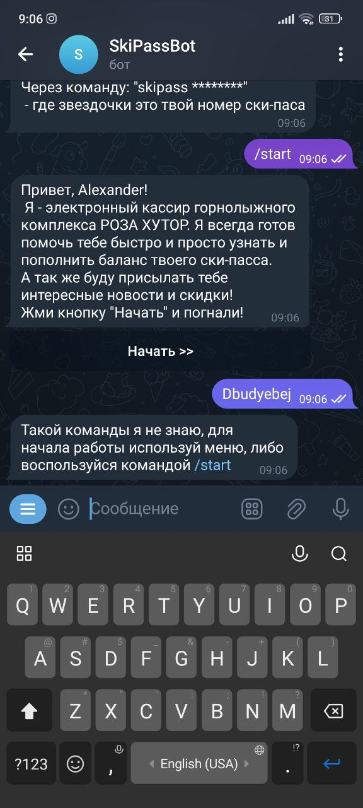

